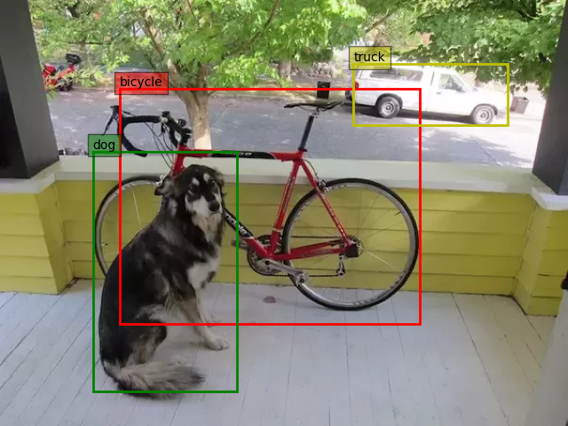

# Pytorch YOLOv3
A slimmed down implementation of yolov3 for inference using pretrained weights.

## Usage
download coco dataset labbels and weights
```bash
wget https://raw.githubusercontent.com/pjreddie/darknet/master/data/coco.names
wget https://pjreddie.com/media/files/yolov3.weights
```
run ```yolov3.py``` with arguments
```bash
python3 yolov3.py --image dog-cycle-car.png --weights_path yolov3.weights --labels_path coco.names
```
You'll see some output like this:
```bash
Label: bicycle, Confidence: 0.99
Label: truck, Confidence: 0.85
Label: dog, Confidence: 1.00
```

